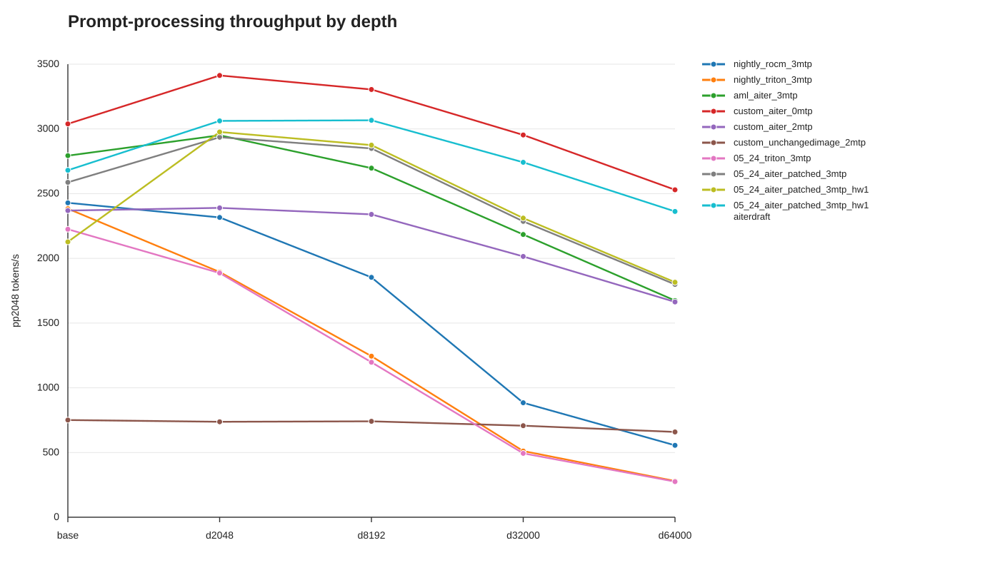
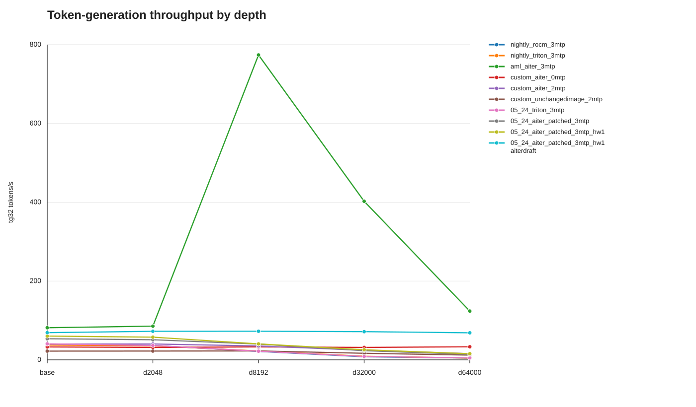

Dockerfiles, compose files, and vLLM patches for running local LLM backends on 2x Radeon AI PRO R9700 GPUs.

The selected vllm profile serves on port `8000`. `chatui` is exposed on port `8001`, and the Aspire dashboard is exposed on port `8002` for traced vLLM profiles.

## Requirements

- Podman with `podman compose` (`docker` should work, but is untested)
- 1 or more R9700 (default compose files assume 2 with `-tp 2`, cause that's what I have)

## Compose profiles

Main profiles in `compose.yaml`:

| Profile | What it runs |
| --- | --- |
| `vllm-rocm-wheel` | Builds/runs the unpatched vLLM ROCm wheel image. Select the vLLM stream with `.env/env.vllm.latest` or `.env/env.vllm.nightly`, and select the ROCm SDK with `.env/env.rocm713` or `.env/env.rocm714`. |
| `vllm-rocm-wheel-nightly` | Backward-compatible profile alias for `vllm-rocm-wheel`. |
| `vllm-rocm-wheel-gfx12x-patched` | Builds from the selected `vllm-rocm-wheel` image, applies the custom gfx12x/R9700 patch, and runs AITER unified attention. |
| `vllm-aml` | Runs the external `aml731/vllm-aiter` image. Note: I can't vet the contents of this container, as it's not mine, but it indeed is very fast and also enables unified attention |
| `llamacpp-rocm` | Runs llama.cpp's ROCm server image. |
| `llamacpp-vulkan` | Runs llama.cpp's Vulkan server image. |
| `atom` | Runs the ROCm Atom dev image. (doesn't work but keeping as a reference) |

## How to run

The preferred entrypoint is `just`. The recipes take explicit parameters for
the ROCm env file, vLLM env file, patch mode, and AITER env file:

```sh
just build-images
just up
just logs
just check-versions
just down
just clear-vllm-caches
```

The defaults are `.env/env.rocm713`, `.env/env.vllm.latest`, `gfx12x-patched`,
and `.env/env.aiter.bundled`. Use `unpatched` as the patch mode to build/run
the unpatched base image. `just up` starts the selected vLLM service plus
`chatui`; `just down` stops/removes every generated `vllm-rocm-wheel-*`
container and `chatui`, so you do not need to remember the exact parameter
combination that launched it.

`just logs` finds the running generated `vllm-rocm-wheel-*` container and
follows its logs. It defaults to `--tail 200`; pass a number to change that,
for example `just logs 1000`.

`just clear-vllm-caches` removes the host cache directories mounted into vLLM:
Hugging Face, vLLM, Triton, TorchInductor, AITER, COMGR, and TVM FFI caches
under `~/.cache`.

When passing extra compose args, specify all four recipe parameters first:

```sh
just up .env/env.rocm713 .env/env.vllm.latest gfx12x-patched .env/env.aiter.bundled
```

Images built through `just` are tagged with the parameter values, not the
specific versions inside the env files, for example:

```text
localhost/vllm-rocm-wheel:rocm713-vllm-latest-gfx12x-patched-aiter-latest
```

The underlying compose setup is still manual and visible. `compose.yaml` uses
the generated variables `VLLM_BASE_IMAGE`, `VLLM_BASE_CONTAINER_NAME`,
`VLLM_PATCHED_BASE_IMAGE`, `VLLM_PATCHED_IMAGE`, and
`VLLM_PATCHED_CONTAINER_NAME`; the Just recipes compute those values directly
from their parameters and pass them to `podman compose`. To run compose
manually, use the same env files and variables shown in the Justfile, then name
the vLLM service explicitly so no unrelated no-profile services are started.

The ROCm SDK build args are required. Pass `--env-file .env/env.rocm714` for the
current nightly SDK wheel layout, or `--env-file .env/env.rocm713` for the
previous stable SDK wheel layout. Pass `--env-file .env/env.vllm.latest` or
`--env-file .env/env.vllm.nightly` to select the vLLM wheel stream.

## Updating nightly vLLM wheels

Nightly wheels rotate frequently. If the nightly build fails because the pinned wheel no longer exists, update `.env/env.vllm.nightly`.

For the nightly service, visit the vLLM wheel directory, for example:

```text
https://wheels.vllm.ai/rocm/nightly/rocm722/vllm
```

Copy the current vLLM version from that directory and paste it into
`VLLM_VERSION` in `.env/env.vllm.nightly`.

## Updating nightly ROCm SDK wheels

The ROCm SDK wheels come from:

```text
https://rocm.nightlies.amd.com/whl-multi-arch/
```

For gfx1201, keep `ROCM_SDK_CORE_VERSION`, `ROCM_SDK_LIBRARIES_VERSION`, and `ROCM_SDK_DEVEL_VERSION` on the same nightly version in `.env/env.rocm714`. Compose service `env_file` entries do not feed `build.args`, so these build values are supplied through Compose variable interpolation and selected with `podman compose --env-file ...`.

The old stable ROCm wheel index and 7.13 package names live in `.env/env.rocm713`.

## Custom gfx12x/R9700 patches

Patch files:

```text
docker/patches/GFX12x_R9700_AITER_ENABLEMENT.patch
docker/patches/GFX12x_R9700_rocm713_RUNTIME.patch
```

Patch image:

```text
docker/Dockerfile.wheel-gfx12x-patched
```

The patched Dockerfile starts from the generated `VLLM_PATCHED_BASE_IMAGE`,
installs the ROCm SDK development files needed at runtime, copies both patches
into the image, applies them inside Python `site-packages` with `git apply`,
and then `py_compile`s the touched vLLM files. The apply step is idempotent: it
applies each patch when possible and reports when a patch is already present.

Use it through `just`:

```sh
just build-images .env/env.rocm713 .env/env.vllm.nightly gfx12x-patched .env/env.aiter.bundled
just up .env/env.rocm713 .env/env.vllm.nightly gfx12x-patched .env/env.aiter.bundled
```

By default, the patched build keeps the AITER wheel bundled by the vLLM wheel
index. To try the opt-in AITER wheel:

```sh
just build-images .env/env.rocm713 .env/env.vllm.nightly gfx12x-patched .env/env.aiter.latest
```

What the split does, briefly:

- `GFX12x_R9700_AITER_ENABLEMENT.patch` treats gfx12x/R9700 as an AITER-supported ROCm architecture in vLLM runtime checks and allows the ROCm AITER attention backend on gfx12x.
- `GFX12x_R9700_rocm713_RUNTIME.patch` contains ROCm 7.13/nightly runtime fixes needed for vLLM startup and serving, including gfx12x FP8 fused MoE support checks, TileLang import avoidance on gfx12x, AITER unified-attention import/API compatibility, AITER sampler gating, and cache/fusion guards.

These are local runtime patches against the installed vLLM wheel. They do not modify AITER package code, but the ROCm 7.13 runtime patch does include vLLM-side compatibility shims for current ROCm/AITER nightly wheel behavior. When the nightly wheel changes, the patches will need to be refreshed if upstream files move or change.

## Benchmarks

Benchmark source files live in `benchmarks/`. Values below are mean `t/s` with the `+/-` ranges omitted for readability. Each speed cell is `pp2048 / tg32`. Depth columns are sampled from the full benchmark output; `d1024`, `d4096`, and `d16384` are omitted here. `AITER_UA` means `ROCM_AITER_UNIFIED_ATTN`; `HWQ` means `GPU_MAX_HW_QUEUES`.

All benchmarks use the images from this repo and run on my machine with 2x R9700 and a Ryzen 9900X3D.

**If you want to know what VLLM launch settings / env vars each benchmark corresponds to, just look in the benchmarks/ dir where the raw data lives - it includes a fully copy/paste of the state of the compose file at the time the benchmark was run.**





> Note: I have absolutely no idea what AML's image is doing to obtain the insane tg speeds, or if that's somehow misleading data, or what.

| Benchmark | Image/config | MTP | Attention | HWQ | Meaningful difference | base | d2048 | d8192 | d32000 | d64000 |
| --- | --- | ---: | --- | --- | --- | ---: | ---: | ---: | ---: | ---: |
| `nightly_rocm_3mtp` | stock nightly dev236 | 3 | `ROCM_ATTN` | - | baseline ROCm attention | 2429.06 / 38.97 | 2316.16 / 36.59 | 1853.30 / 21.40 | 884.30 / 7.87 | 555.47 / 4.65 |
| `nightly_triton_3mtp` | stock nightly dev236 | 3 | `TRITON_ATTN` | - | Triton flash attention enabled | 2383.51 / 37.61 | 1894.56 / 35.74 | 1244.40 / 22.44 | 511.34 / 9.17 | 279.69 / 4.50 |
| `aml_aiter_3mtp` | `aml731/vllm-aiter:v0.20.2` | 3 | `AITER_UA` | - | AITER MHA, chunked prefill, GPU util 0.95 | 2793.63 / 81.51 | 2951.10 / 85.54 | 2696.97 / 773.88 | 2184.32 / 402.44 | 1673.88 / 123.78 |
| `custom_aiter_0mtp` | patched image | 0 | `AITER_UA` | - | MTP off, AITER on, selected fusions disabled | 3038.89 / 32.78 | 3413.06 / 31.56 | 3304.74 / 32.92 | 2953.29 / 31.53 | 2529.74 / 33.17 |
| `custom_aiter_2mtp` | patched image | 2 | `AITER_UA` | - | AITER on, selected fusions disabled | 2369.27 / 39.94 | 2390.06 / 40.26 | 2339.78 / 35.25 | 2014.85 / 24.39 | 1663.42 / 15.62 |
| `custom_unchangedimage_2mtp` | unchanged nightly image | 2 | `AITER_UA` | - | AITER requested without patched image | 750.86 / 22.20 | 737.36 / 22.34 | 741.00 / 22.62 | 707.09 / 16.66 | 658.85 / 12.06 |
| `05_24_triton_3mtp` | stock nightly dev267 | 3 | `TRITON_ATTN` | - | newer nightly, Triton attention | 2225.01 / 40.60 | 1886.69 / 36.53 | 1197.28 / 21.94 | 493.52 / 8.63 | 275.05 / 4.96 |
| `05_24_aiter_patched_3mtp` | patched nightly dev267 | 3 | `AITER_UA` | - | patch + AITER unified attention | 2587.54 / 53.56 | 2935.76 / 51.01 | 2849.15 / 40.05 | 2285.87 / 23.26 | 1798.61 / 13.93 |
| `05_24_aiter_patched_3mtp_hw1` | patched nightly dev267 | 3 | `AITER_UA` | 1 | same as previous, `GPU_MAX_HW_QUEUES=1` | 2127.41 / 60.29 | 2976.45 / 57.58 | 2874.83 / 40.45 | 2310.98 / 25.59 | 1815.35 / 15.54 |
| `05_24_aiter_patched_3mtp_hw1_aiterdraft` | patched nightly dev267 | 3 | `AITER_UA` | 1 | speculative `attention_backend=AITER_UA` | 2680.65 / 69.02 | 3062.04 / 72.45 | 3066.71 / 72.57 | 2742.06 / 71.57 | 2362.50 / 68.64 |